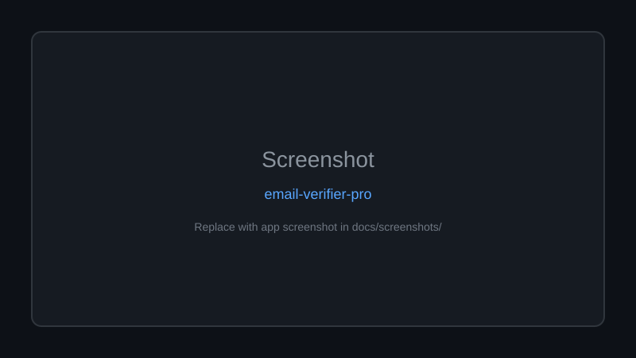
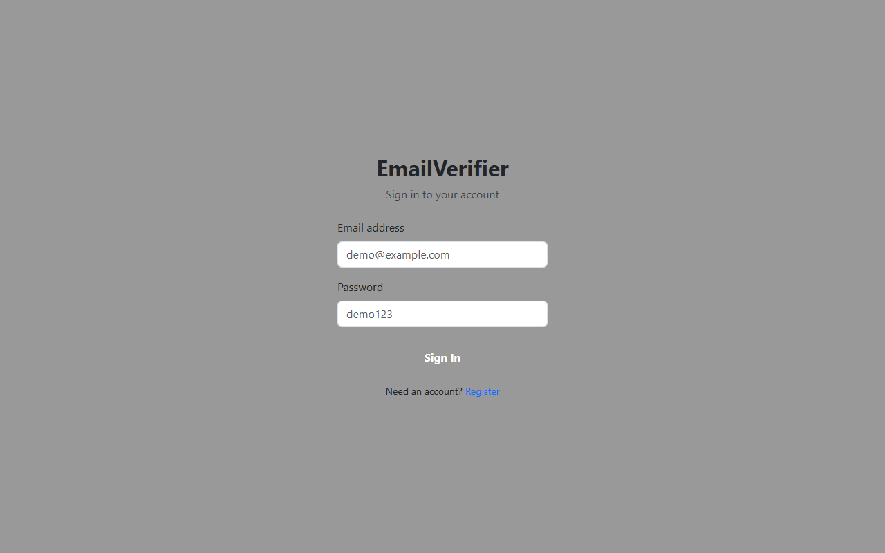

<div align="center">

# 🚀 Email Verifier Pro

**A full-stack Email Verification Web App built with Node.js, Express, MongoDB, JWT Auth, bulk CSV/XLSX validation, dashboard analytics, and validation history.**

Documented · MIT licensed · Maintained


[](LICENSE)
[](CONTRIBUTING.md)

[Features](#-features) · [Quick Start](#-quick-start) · [Screenshots](#-screenshots) · [Contributing](CONTRIBUTING.md)

</div>

---

## 🖼 Screenshots



*Replace `docs/screenshots/placeholder.svg` with real app screenshots.*

---

## 🐍 Contribution graph


<picture>
  <source media="(prefers-color-scheme: dark)" srcset="https://raw.githubusercontent.com/mafzalkalwardev/email-verifier-pro/output/snake-dark.svg" />
  <source media="(prefers-color-scheme: light)" srcset="https://raw.githubusercontent.com/mafzalkalwardev/email-verifier-pro/output/snake.svg" />
  
</picture>


---

A full-stack, modern web application for single and bulk email verification, integrated with the EmailListVerify API.

## Screenshots



## Features
- **Modern Glassmorphism UI:** Responsive and dynamic design with Dark/Light mode support.
- **Authentication:** Dummy registration and login system with JWT.
- **Single Verification:** Real-time email validation.
- **Bulk Verification:** Upload CSV or XLSX files and see real-time progress bars.
- **History & Analytics:** View validation history with pagination, search, and dashboard charts.

## Setup & Configuration

### 1. MongoDB Setup
You need a MongoDB database.
1. Create an account on [MongoDB Atlas](https://www.mongodb.com/cloud/atlas).
2. Create a new cluster and obtain your connection string (URI).
3. Ensure you whitelist your IP address in the network access tab.

### 2. Configure API Keys
You need to set up the `.env` file in the root directory.

Create a file named `.env` and add the following:
```env
PORT=5000
MONGO_URI=your_mongodb_connection_string_here
JWT_SECRET=your_jwt_secret_here
EMAIL_LIST_VERIFY_API_KEY=aZsR9tmvEgbigOIm7CFWrG6Ru3saClBt
EMAIL_LIST_VERIFY_BASE_URL=https://app.emaillistverify.com/api
```
Replace `your_mongodb_connection_string_here` with your actual URI.

### 3. How to Run Locally
1. Clone the repository or navigate to the project folder.
2. Install dependencies:
   ```bash
   npm install
   ```
3. Start the application in development mode:
   ```bash
   npm run dev
   ```
4. Open your browser and navigate to `http://localhost:5000`.

## Deployment Steps

Since this is a full-stack application with a Node.js Express backend and static frontend files, it needs to be deployed as a web service.

### Deploying to Render
1. Create an account on [Render](https://render.com/).
2. Click **New +** and select **Web Service**.
3. Connect your GitHub repository.
4. Settings:
   - **Environment:** Node
   - **Build Command:** `npm install`
   - **Start Command:** `npm start`
5. Go to the **Environment** tab and add all the variables from your `.env` file (MONGO_URI, JWT_SECRET, EMAIL_LIST_VERIFY_API_KEY, EMAIL_LIST_VERIFY_BASE_URL).
6. Click **Deploy**.

### Deploying to Railway
1. Create an account on [Railway](https://railway.app/).
2. Click **New Project** -> **Deploy from GitHub repo**.
3. Select your repository.
4. Once added, click on the service card, go to the **Variables** tab.
5. Add all your `.env` variables.
6. Railway will automatically detect the `package.json` and start the server using `npm start`.

### Deploying to Vercel
Vercel is primarily optimized for serverless functions and frontend frameworks. To deploy this Express app to Vercel:
1. You must create a `vercel.json` file in the root directory:
   ```json
   {
     "version": 2,
     "builds": [
       {
         "src": "server.js",
         "use": "@vercel/node"
       }
     ],
     "routes": [
       {
         "src": "/(.*)",
         "dest": "server.js"
       }
     ]
   }
   ```
2. Note: Multer (file upload) might face issues on Vercel's serverless environment because writing to the disk (`uploads/` directory) is not persistent or sometimes prohibited. For full compatibility, it's highly recommended to use **Render** or **Railway** for applications handling file uploads natively without an external S3 bucket.
3. If you still wish to proceed, push the code to GitHub and import it into Vercel. Add the Environment Variables in the Vercel project settings before the first deployment.

---
Built using Node.js, Express, Axios, and Bootstrap 5.
